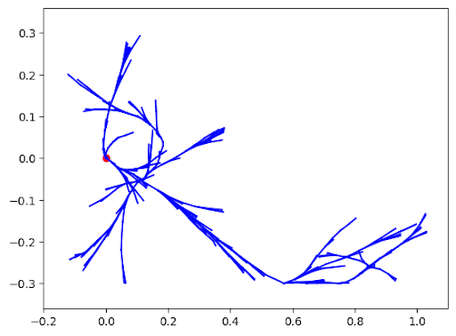
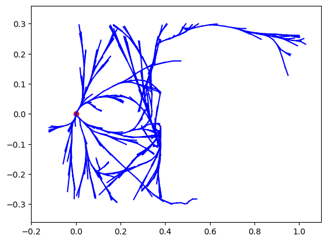

An extension of regular Rapidly-Exploring Random Tree for Kinodynamic Planning with motion constraints

## Algorithm Overview
#### Simulation Function 
Need to define a simulation function to perform forward planning $$x_{next} = h(x, u)$$
 - Use this to to apply sampling based methods to the control space
 - Tree growing techniques better in this case --> why we use RRT

#### Main Idea
 - Maintain a tree $T$ of states connected by feasible paths rooted from the start
 - Grow the tree by sampling a control from an existing state and then applying the simulation function 
 - Terminates when a state is found in the goal region

### Algorithm
```
Kinodynamic-RRT:
	for i in range(N):
		x_rand = sample()
		x_near = nearest(T, x_rand)
		u_e = Choose-Control(x_near, x_rand)
		x_e = Simulate(x_near, u_e)
		if not collision(path(x_near, x_e)):
			add edge x_near -> x_e to T
		if x_e in Goal:
			return path(x_0, x_e)
	return No Path
```

__Metric Choice__:
 - Important to find a feasible solution
 - Euclidean distance may not always be a good idea
	 - For example car, sideways euclidean distance (parallel parking) actually involves a lot of going forwards and backwards to accomplish
- Can use [[Linear Quadratic Regulator|LQR]] for distance metric somehow??

**Choose-Control**:
 - One approach is to choose control that moves from x_near to x_rand
$$u_e = \arg \min_{u \in U} d(x_{rand}, \text{Simulate}(x_{near}, u))$$
 - This can be done by sampling a few random controls and choosing the one that gets closest to $x_{rand}$
	 - Makes rapid progress
	 - Can get stuck though
- In order for KRRT to be probabilistically complete though, it must sample controls at random

**Goal Region instead of Goal State**: 
 - Chance of arriving to an exact single state is 0
 - Hence we use a goal region
 - If [[Steering Function]] was available could replace $x_e \in G$ with test to see if can connect to goal state

## Our Implementation

##### Node Class:
This class holds:
 - The state variable for our robot which holds q and qdot (configuration and its derivative w.r.t  time)
 - A pointer to a parent node in order to trace back the sequence of states in the tree
 - The control that was applied to the node’s parent such that the robot went from parent to current state

##### Helper Methods:
Here, we implemented some generic functions to help us. 
 - **weighted_euclidean_distance**: computes the weighted euclidean distance between nodes
 - **sample_state**: samples a Node (only samples the state, leaves other attributes empty) by taking an array for sample bounds and sampling uniformly within these bounds
 - **sample_non_colliding**: continually samples states until it finds one that does not collide by using 2 function pointers to a sampler function and collision checking function as well as sample bounds

##### The KRRT Class:
This is the main data structure that holds everything we need to implement Kinodynamic RRT
_Properties_:
 - Holds the RRT Tree as a simple list (ideally it would be a k-d Tree for faster nearer neighbor checks)
 - Stores the mujoco model of the world and its data
 - Stores xbounds and ybounds to sample within (ideally this should be a more generic bounds array)
 - Stores the control limits within which we can sample

_Internal Functions_:
 - **get_current_state**:  returns a Node with a copy of the mujoco data’s current state
 - **set_current_state**: Sets mujoco data’s state to a Node’s state, resets the time, and returns a boolean of whether or not the current state is in a collision
 - **nearest_neighbor**: given a Node and a distance metric function, this returns the nearest vertex on the tree to the given Node
 - **sample_ctrl**: Uniformly samples a control within self.ctrl_limits
 - **sample_best_ctrl**: Samples up to n controls and chooses the one which minimizes distance from x1 to x2 (i.e the control that leads us to closest state to x2 if we started at x1)
 - **simulate**: given a state, control, and dt, it continuously applies the control to the state for dt time or until there is a collision. Returns the new state and a boolean as to whether a collision occurred
 - **in_goal**: given a state, this function returns whether or not its configuration is in the goal region
 - **recreate_path**: This method creates the path for the motion plan of the ball by assuming the last element in the tree is the end state retracing the path back to the start state.
 - **visualize_mj**: given a path and the dt, we:
  	- Create mujoco model and data from xml and set the configuration to the start state
  	- Create a custom camera and viewer to see and render the path
  	- For each node in the rest of the path (not including the start), we set data.control to the node’s control. We then apply the control for dt time and render (We don’t need to render this often, but it simplifies the code)
  	 - Note: this requires the dt to be exactly what the kRRT algorithm feeds into to simulate so that the visualization and path of states actually line up

_Main Method_:
 - **kRRT**: Uses all of the helper methods to implement the full Kinodynamic RRT algorithm. It uses the probabilistically complete version of just sampling a random control. The algorithm runs while the total time it has taken is less than T_max. Here is a step by step explanation of the loop to expand the RRT tree:
  	- It samples a non colliding state.
  	- It computes the nearest neighbor to the sample.
  	- It samples a random control.
  	- It then simulates applying this control to the nearest state.
  	- If at any point this simulation results in a collision, we add the time spent to our total time taken and continue to the next iteration (so we don’t perform the below steps).
  	- Given the new state we found by applying the control to the nearest state, we set its parent to the nearest state, set the control to the control that was applied, and append it to the tree
  	- We then check if the new state is in the goal region. 
  	- If it is, we print the amount of time the algorithm took and how many nodes we have in the tree (which is fewer than total iterations this loop ran since we don’t include nodes that had collisions), recreate the path that the robot took to get to the end state, visualize the full tree in matplotlib, visualize the path in mujoco, and return the path.
  	- If it’s not, we add the time this iteration took and continue.


Challenges:
One significant challenge we faced was a bug where x_e and x_near in the kRRT algorithm had the exact same state. After some debugging and tweaking, we finally found that the bug was a pointer/dereferencing error in the simulate function. The simulate function computes the current state at each mujoco step in order to check for collisions. When we looked at the final node computed by the simulate function, we noticed that it was the same as the initial node. However, with debugging input, we found the actual initial configuration and final configuration was different. To fix the error, we looked at our get_curr_state function. The function creates a node using self.data.qpos and self.data.qvel which are pointers to the numpy arrays of the actual mujoco data. As we called mujoco.mj_step, they would get overwritten. Once we created copies of these arrays, we found our solution. 

Tree Visualization
Seed 30: 


Seed 42: 


Seed 73:


Mujoco Visualization:


Trials 

| T_max (seconds) | Success Rate |
|-----------------|--------------|
| 30              | 100%         |
| 20              | 100%         |
| 10              | 90%          |
| 5               | 76.67%       |

From the trials, we can see that increasing T_max improves the success rate of the algorithm. At 5 seconds, the success rate drops dramatically whereas the success rate is consistently high around 20 and 30 seconds. We can also see that the success rate does not seem to increase linearly, but rather jumps until it hits a certain threshold.
